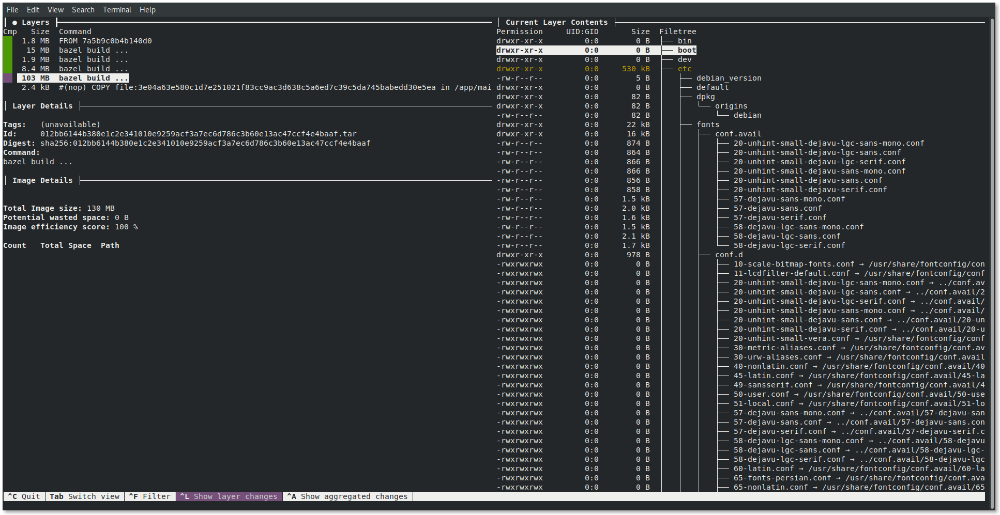
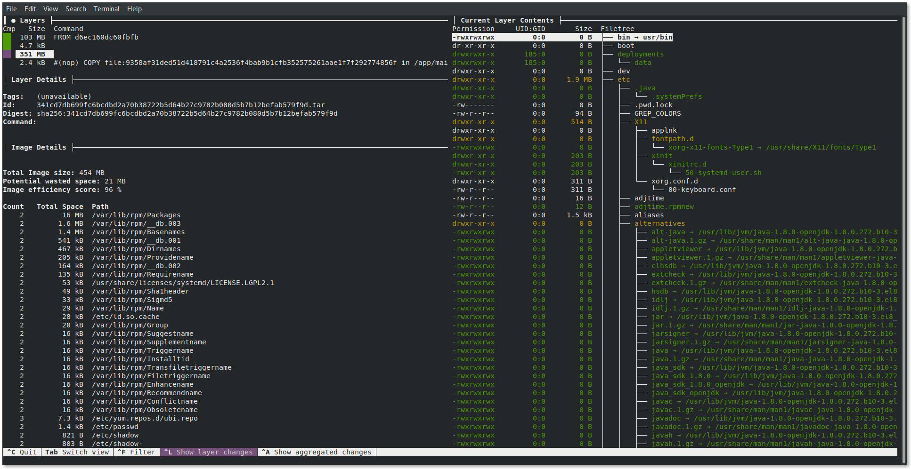
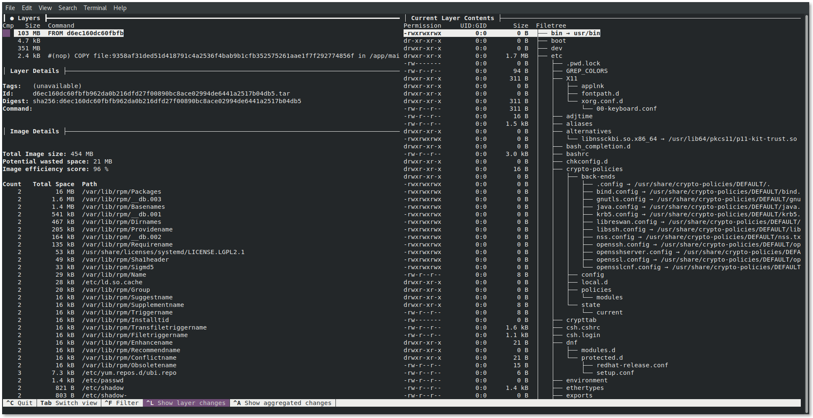

:source-highlighter: highlightjs
:data-uri:
:toc: left
:markup-in-source: +verbatim,+quotes,+specialcharacters
:icons: font
:stylesdir: stylesheets
:stylesheet: colony.css

= UBI vs Distorless Images

.*Goals*

quick introduction to both  UBI & Distorless Images, and try to compare the application container generated from both of them to see which is more optimal. 

.*References:*
** https://github.com/GoogleContainerTools/distroless[]
** https://github.com/GoogleContainerTools/distroless/blob/master/examples/java/Dockerfile[]
** https://github.com/wagoodman/dive[]
** https://docs.docker.com/develop/develop-images/multistage-build/[]
** https://www.redhat.com/en/blog/introducing-red-hat-universal-base-image[]
** https://developers.redhat.com/products/rhel/ubi[]

.*Background:*

It all start with an email from my colleague https://github.com/rovandep[Romuald Vandepoel], where he mentioned

[quote, Romuald Vandepoel, Extracted from email "Weekly report NUMBER"]
____
*this is a multi layer built using the go-toolset to compile a functional Go application then layered it with a distroless base, UBI and UBI minimal, here the final footprint:*

[source,bash]
----
# podman images
REPOSITORY                                    TAG      IMAGE ID       CREATED        SIZE
localhost/ubi-minimal-go                      latest   8fac5e0bcbdf   5 hours ago    112 MB
localhost/ubi-go                              latest   1f62a98919fa   5 hours ago    216 MB
localhost/distroless-go                       latest   4a336c7e8eed   21 hours ago   26.3 MB
----
____

Really !! ubi-minimal is 112 MB and distroless-go is 26.3. So i thought to give it a try

So we have a common java application which emit "hello world", and we will try to build it using both UBI-minimal & Distroless.

In both cases we will https://docs.docker.com/develop/develop-images/multistage-build/[use multi-stage builds] to keep the image size minimal.
and we will use https://github.com/wagoodman/dive[dive], A tool for exploring a docker image, layer contents, and discovering ways to shrink the size of your Docker/OCI image.

:sectnums:

== GoogleContainer Distroless

=== What is GoogleContainer Distroless
"Distroless" images contain only your application and its runtime dependencies. They do not contain package managers, shells or any other programs you would expect to find in a standard Linux distribution.

For more information, see this talk https://www.youtube.com/watch?v=lviLZFciDv4[(video)].

So in your Dockerfile you cannot do things like

[source,Dockerfile]
----
RUN mkdir /mydir
----

=== Build the sample java app using GoogleContainer Distroless
to build the java sample application, use the following command.

[source,bash]
----
podman build --pull --rm -f Dockerfile-destroless -t java-sample-distroless:latest
podman run  -p 8080:8080 java-sample-distroless:latest
----

and you can test by pointing your browser to http://localhost:8080/[]

=== Inspect the Distroless Image using dive

[source,bash]
----
dive java-sample-distroless:latest --source podman
----

image::img/distroless-1.png[500,600]

== RedHat UBI

=== What is RedHat UBI

 Red Hat Universal Base Images (UBI) are OCI-compliant container base operating system images with complementary runtime languages and packages that are freely redistributable. Like previous base images, they are built from portions of Red Hat Enterprise Linux. UBI images can be obtained from the Red Hat container catalog, and be built and deployed anywhere.

as per https://developers.redhat.com/products/rhel/ubi[]

Red Hat provides these three base images for starting your container development:

3 UBI base image options

* Standard

** Image name: ubi
*** Unified, OpenSSL crypto stack
*** Full YUM stack
*** Includes useful basic OS tools (tar, gzip, vi, etc.)

https://access.redhat.com/documentation/en-us/red_hat_enterprise_linux/8/html-single/building_running_and_managing_containers/index#using_standard_red_hat_base_images[UBI Platform documentation]

* Minimal

** Image name: ubi-minimal

*** Minimized pre-installed content set
*** No suid binaries
*** Minimal package manager (install, update, and remove)

https://access.redhat.com/documentation/en-us/red_hat_enterprise_linux/8/html-single/building_running_and_managing_containers/index#using_minimal_red_hat_base_images[UBI minimal documentation]

* Multi-service
** Image name: ubi-init

*** run mysql and httpd side-by-side in the same container
*** run systemd in a container on start
*** Enables services at build time

https://access.redhat.com/documentation/en-us/red_hat_enterprise_linux/8/html-single/building_running_and_managing_containers/index#using_init_red_hat_base_images[UBI Multi-service documentation]

=== Build the sample java app using UBI min
to build the java sample application, use the following command.

NOTE: don't forget to login to registry.redhat.io as ubi images are hosted there and service account is needed. Please check https://access.redhat.com/RegistryAuthentication[Red Hat Container Registry Authentication]

[source,bash]
----
podman build --pull --rm -f Dockerfile-ubi -t java-sample-ubi:latest
podman run  -p 8080:8080 java-sample-ubi:latest
----

and you can test by pointing your browser to http://localhost:8080/[]

=== Inspect the UBI Image using dive

[source,bash]
----
dive java-sample-ubi:latest --source podman
----

== Conclusion

Distorless

[source,bash]
----
│ Image Details ├────────────────────────────────────────────────────────────────────────────────────────
Total Image size: 130 MB
Potential wasted space: 0 B
Image efficiency score: 100 %
----

UBI

[source,bash]
----
│ Image Details ├────────────────────────────────────────────────────────────────────────────────────────
Total Image size: 454 MB
Potential wasted space: 21 MB
Image efficiency score: 96 %
----
